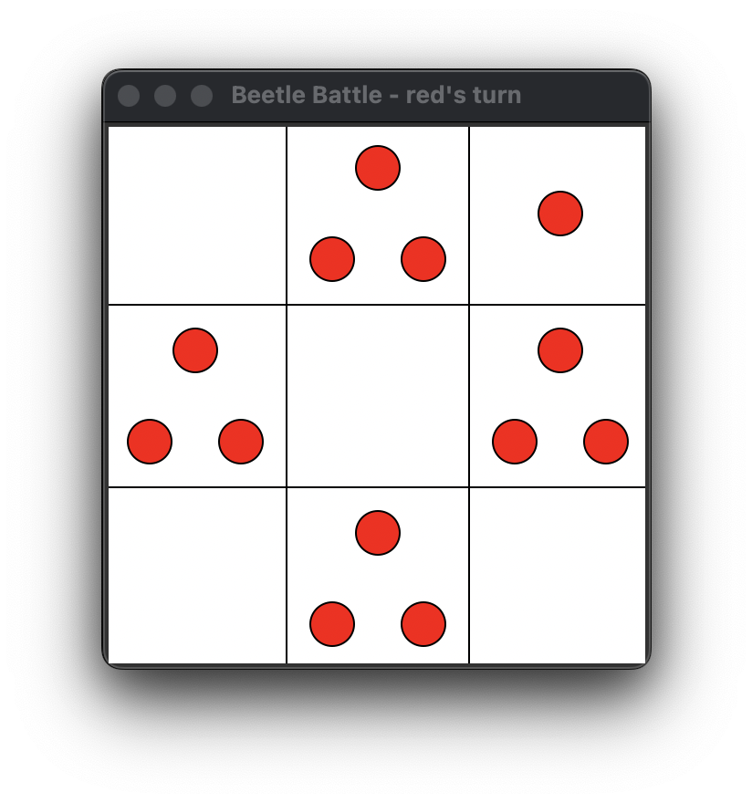

# Beetle Battle game manual
<hr>
<i>
<p>
Beetle Battle is an engaging and strategic board game for two players played on a grid of squares.
<p>
Each turn a player places a 'beetle' on one of the squares of the board that is empty or contains beetles of the same color. When a square contains the maximum capacity of beetles, the beetles will jump-out and spread out to the adjacent squares. When these squares already contain beetles of the opposite color, these beetles are conquered and change color.
<p>
A player wins when all the beetles of the other player are conquered.
<p>
With beetles jumping onto already occupied squares, the maximum capacity of these squares can be reached, resulting in the beetles jumping also. Especially later on in the game this can create a whole cascade of jumping beetles, making the game very unpredictable and exciting.
</i>
<hr>

## Board

### Dimension
The gameplay takes place on an $n \times n$ board with $n$ being the _dimension_ which can be set to 3, 5, 7, 9, or 11.

The dimension determines the grid of squares as shown in the screenshots below.


The dimension can be selected in the menu under the "Board" menu item.

### Squares
Squares are identified by their _row_ and _column_ as illustrated in the figure below.


These coordinates are used to specify the move in stored games (see "[Save game](#save-game)").

### Square capacity
A square has a certain _capacity_ which is defined by the number of adjacent squares as illustrated in the figure below.


The capacity indicates when the beetles will jump out of the square as will be described further below (see "[Jumping beetles](#jumping-beetles)").

## Making a move
A beetle can be placed on an empty square or a square containing beetles of the same color. To make it easier, the squares on which no beetle can be placed are greyed-out as shown in the screenshot below where it is blue's turn.


## Jumping beetles
When placing a beetle on a square and the number of beetles becomes the same as the capacity of the square, all beetles will jump to the adjacent tiles, with one beetle to each adjacent tile. This is illustrated in the screenshots below where a red beetle is placed on square (1,1) in the left screenshot, resulting in the beetles jumping to the adjacent squares resulting in the right screenshot.


## Game over
When a player has no more beetles on the board, it's game over as shown in the screenshot below.


Pressing "OK" will start a new game.

### Save game
When the game end and the winner is announced, pressing "Save game" will create a CSV file with the moves and opens the file dialog to select the name of the file and location where to save it.

Consider the game in the screenshots below.




The content of CSV file ifor this game will as given below.

```
dimension: 3
winner: red

move_number,color,row,column
1,red,0,0
2,blue,2,2
3,red,0,1
4,blue,1,2
5,red,1,1
6,blue,2,1
7,red,1,0
8,blue,2,1
9,red,1,0
10,blue,2,1
11,red,0,2
12,blue,1,1
13,red,1,0
```
## References and acknowledgements
Beetle Battle is a stylized version of an old game concept called "EXPLOSION" as first encountered by the author around 1984 in an old book with [BASIC](https://en.wikipedia.org/wiki/BASIC) programs for the [TI99/4A](https://en.wikipedia.org/wiki/TI-99/4A) called ["Terrific games for the TI99/4A"](./literature/terrific-games-for-the-ti994a.pdf).

As a board game there are similarities with the classic board games Go and Othello (also known as Reversi) but due to its dynamics (i.e. the cascade of juming beetles that will occur), it is only practically playable on a computer.

It is also offered as the game "Chain Reaction" for Android by Buddy Matt Entertainment ([Google Play Store](https://play.google.com/store/apps/details?id=com.BuddyMattEnt.ChainReaction&pcampaignid=web_share)). In this mobile game players place their orbs in a cell. Once a cell has reached critical mass the orbs explode into the surrounding cells adding an extra orb and claiming the cell for the player. A cell is critical if the orbs equal the number of surrounding cells.

"Chain reaction" was also implemented in Python many years ago ([GitHub repository](https://github.com/Agnishom/ChainReactionAI)). The author also describes a heuristic strategy ([brilliant.org/wiki/chain-reaction-game](https://brilliant.org/wiki/chain-reaction-game/)).

An _heuristic strategy_ refers to a set of guidelines or principles used by a player to make decisions during the game, especially in situations where calculating the optimal move is too complex or time-consuming. Heuristics in games are often simpler, rule-of-thumb strategies that help players make good (though not necessarily optimal) choices quickly.

For Beetle Battle a heurist strategy is required because of the _[combinatorial explosion](https://en.wikipedia.org/wiki/Combinatorial_explosion)_ of the set of possible moves each turn.
