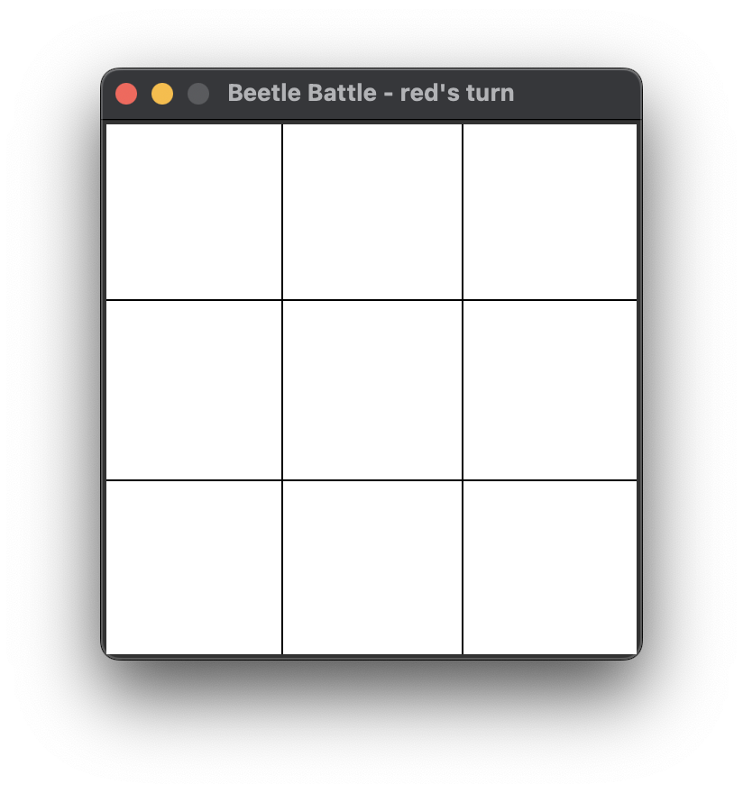
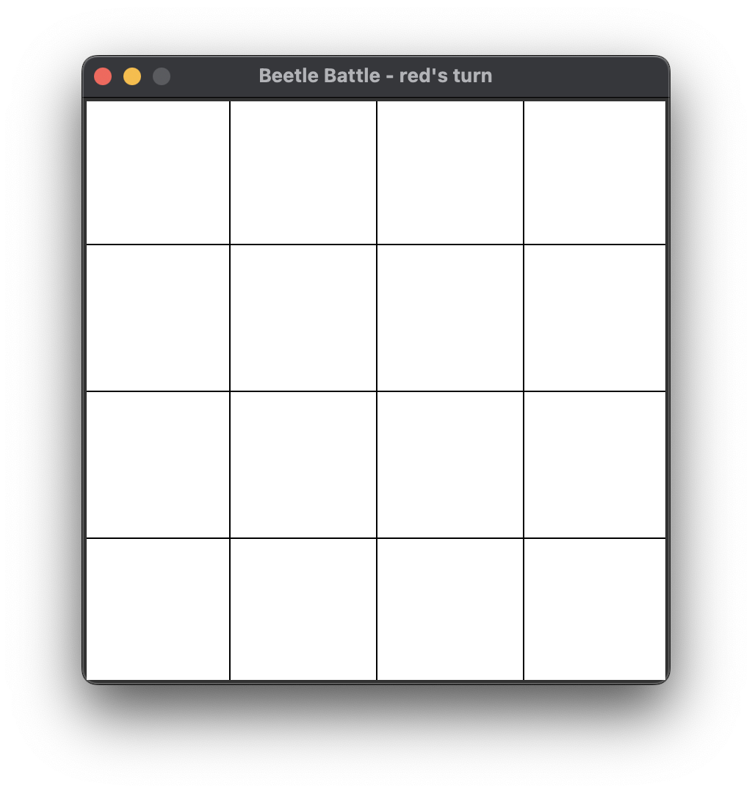
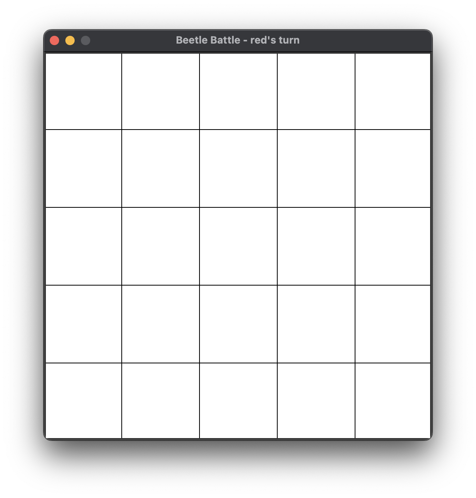
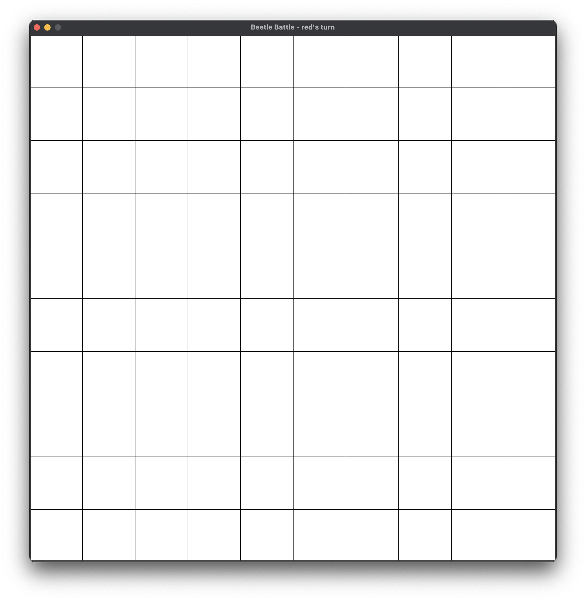
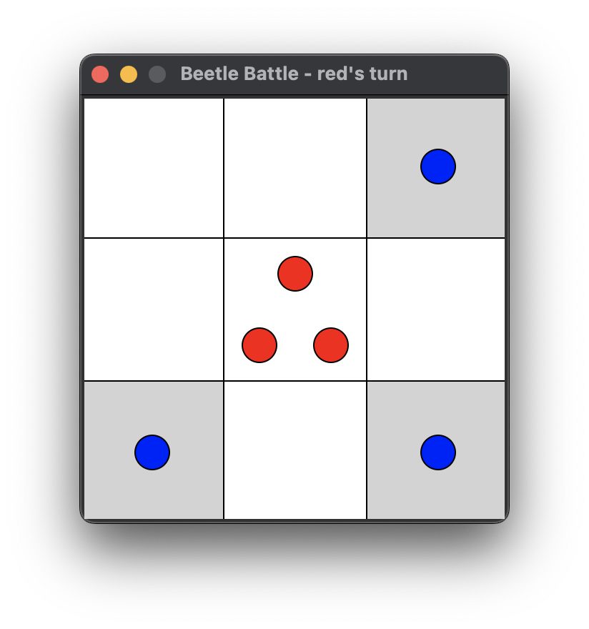
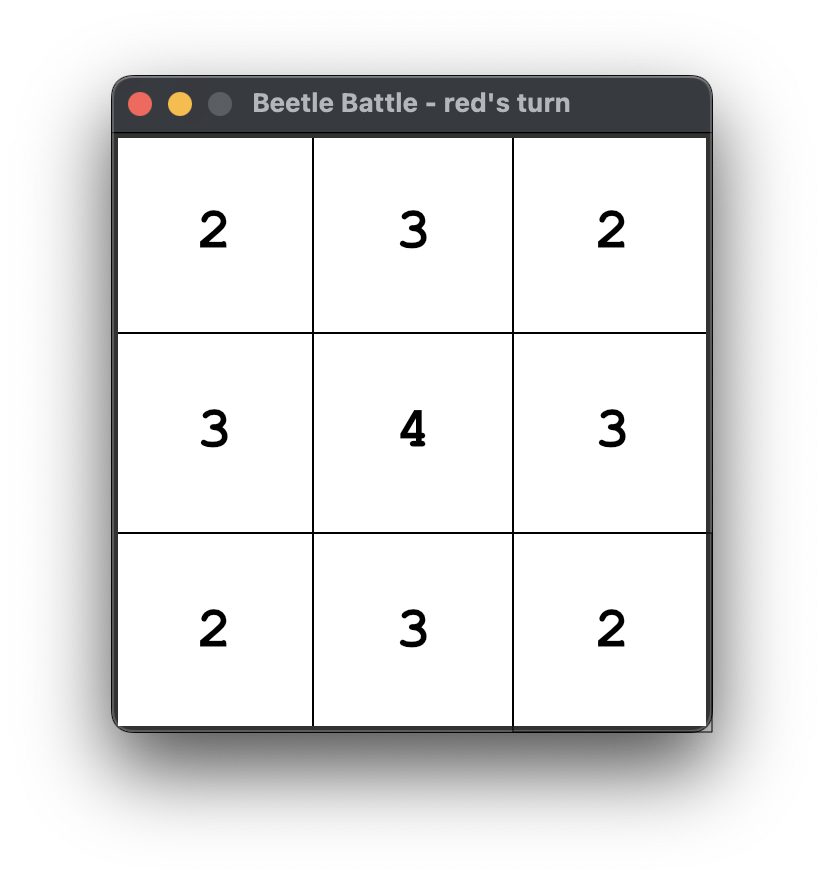
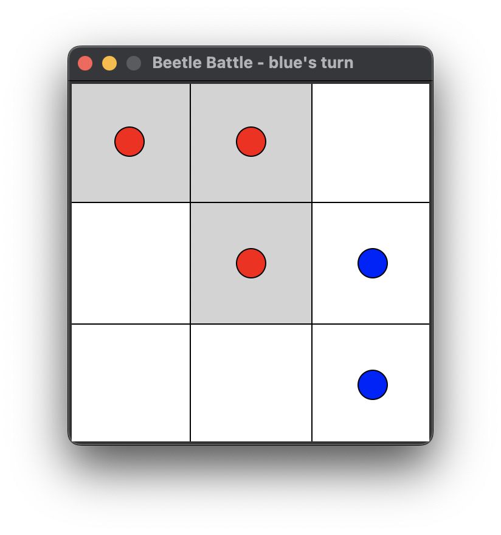
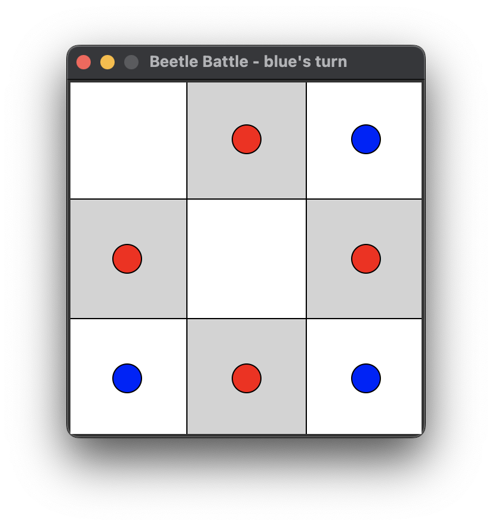

# Beetle Battle game manual

## Board
Beetle Battle is a turn based board game. 

### Dimension

The board has a certain _dimension_ which can be 3, 4, 5 or 10. The dimension determins the grid of squares as shown in the figures below.



The dimension can be selected in the menu under the "Board" menu item.

### Squares
Squares are identified by their _row_ and _column_ as illustrated in the figure below.



These coordinats are used to specify the move in stored games (see "[Save game](#save-game)).

### Square capacity
A square has a certain _capacity_ which is defined by the number of adjacent squares as illustratd in the figure below.



The capacity indicates when the beetles will jump out of the square as will be described further below (see "[Jumping beetles](#jumping-beetles)").

## Making a move
A beetle can be placed on an empty square or a square containing beetles of the same color. To make it easier, the squares on which no beetle can be placed are greyed-out as shown in the screenshot below where it is blue's turn.


## Jumping beetles
When placing a beetle on a square and the number of beetles becomes the same as the capacity of the square, all beetles will jump to the adjacent tiles, one beetle to each adjacent tile as illustrated in the figures below where a red beetle is placed on square (1,1) in the left figure, resulting in the beetles jumping to the adjacent squares resulting in the right figure.



## Game over
When a player has no more beetles on the board, it's game over as shown in the screenshot below.


Pressing "OK" will start a new game.

### Save game
When the game end and the winner is announced, pressing "Save game" will create a CSV file with the moves and opens the file dialog to select the name of the file and location where to save it.

An example of the content of such a file is given below.

```
dimension: 3
winner: blue

move_number,color,row,column
1,red,0,0
2,blue,2,2
3,red,0,1
4,blue,1,2
5,red,1,1
6,blue,2,1
7,red,1,0
8,blue,2,1
9,red,1,0
10,blue,2,1
11,red,0,2
12,blue,1,2
13,red,0,2
14,blue,0,1
```
