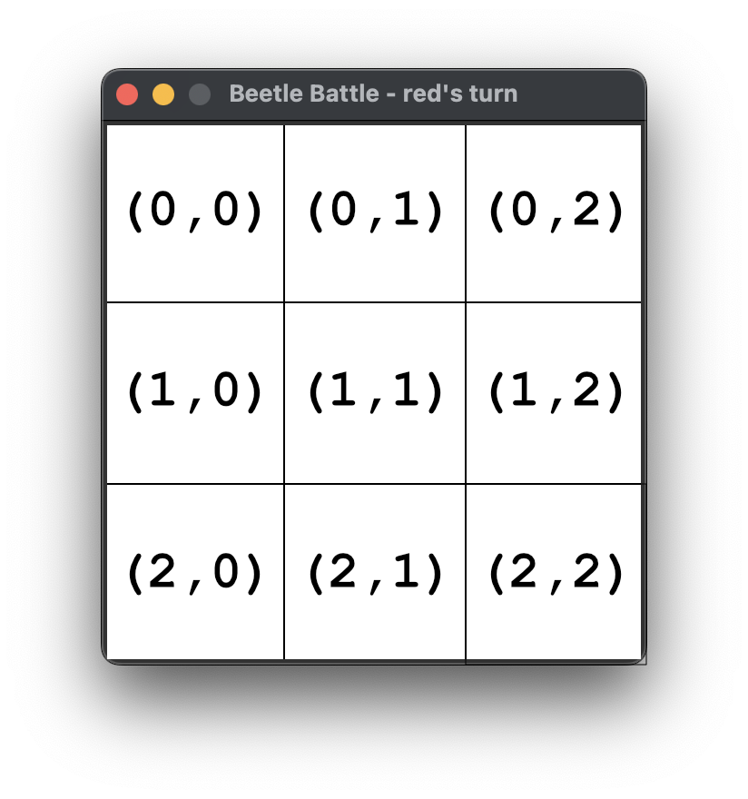

# Beetle Battle game manual

## Making a move
A beetle can be placed on an empty square or a square containing beetles of the same color.

## Jumping beetles
When placing a beetle on a square and the number of beetles becomes the same as the capacity of the square, all beetles will jump to the adjacent tiles, one beetle to each adjacent tile as illustrated in the figures below.

